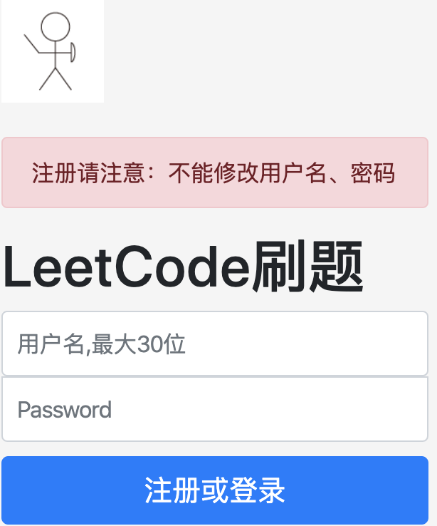
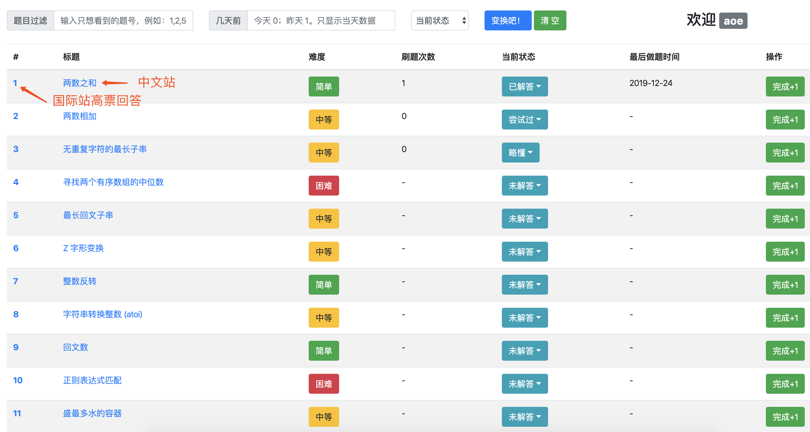

# LeetCode 刷题记录 助力无毒神掌学习

- 感谢覃超小魔王传授无毒学习法

## [在线地址](https://leetcode.aoeai.com/)

## 功能简介

1. LeetCode刷题记录工具。
2. 快速知道今天要刷哪道题（根据无毒法推算，半自动，但比记事本快很多）。
3. 适合对象：极客时间算法训练营学员、希望记录LeetCode刷题记录的朋友。

## 特别说明
1. 只做过简单测试，满足日常需求。
2. 注册用户时请慎重，因为没有修改用户名、密码的功能（最短均为1位）。
3. 个人开发，不能保证数据不丢失，不能作为重要数据存证。
4. 只有2个页面。
5. 主要功能需要登录后使用。

## 页面展示

- 首页

- 问题列表

